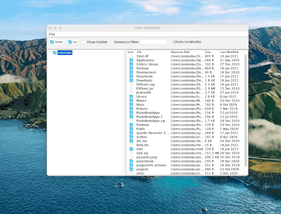

# File Tree
File Tree is a multiplatform Kotlin based software for files and directories viewing.  

Main features:
- FTP servers browsing support (File -> Open FTP address)
  
- Text files, images and ZIP/JAR archives content preview
  
- File extension filtering  
  
- Show hidden files
- Open files
  

## Building File Tree
Building File Tree requires JDK and Kotlin.  
To build executable jar file navigate to the project root directory and run command:  

```gradle clean build```

## Running File Tree
To run File Tree build it from source code and run following command in the terminal:  

```java -jar build/libs/FileTree-1.0.jar```

To run tests:  
```gradle test```